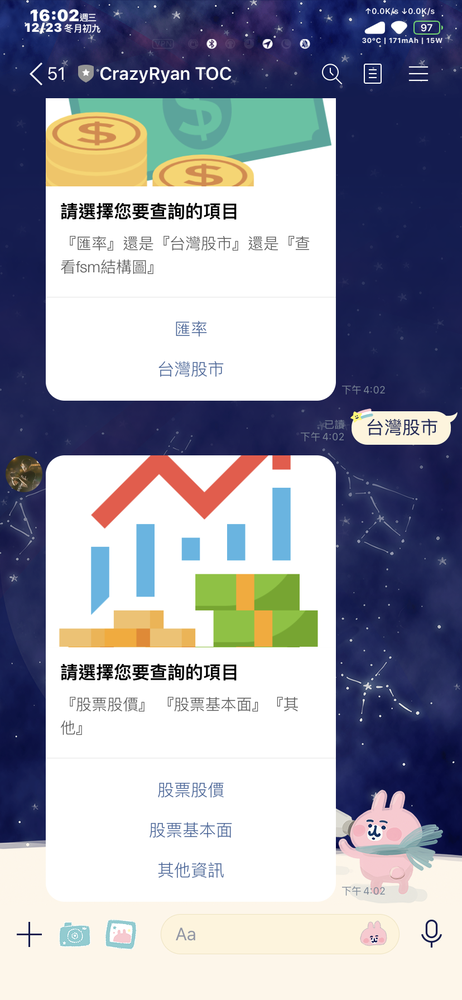
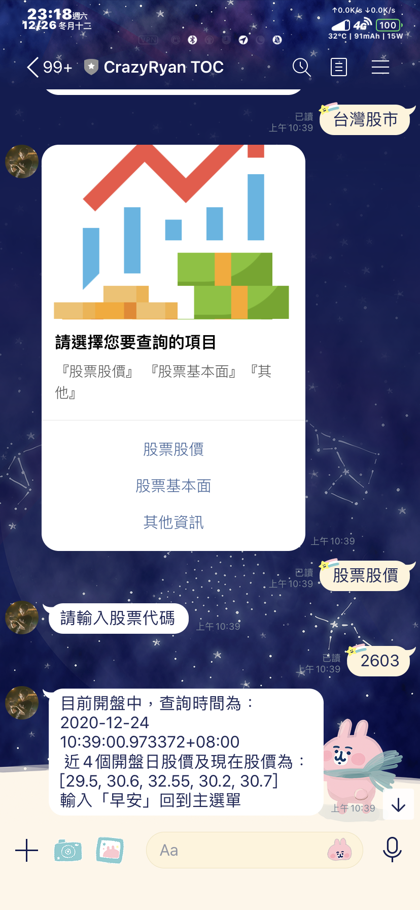
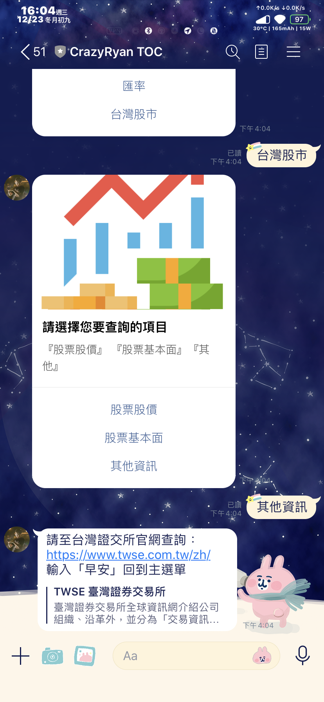

# 歡迎使用CrazyRyan-TOC

### Bot information
Bot basic ID
@118uqybf

QR code  
 

## 使用相關程式及工具

### 使用語言
Python 3.8
### 使用工具(抄自requirements)
```sh
預設程式
certifi==2019.9.11
chardet==3.0.4
click==7.0
flask==1.0.2
future==0.18.1
idna==2.8
itsdangerous==1.1.0
jinja2==2.10.3
line-bot-sdk==1.14.0
markupsafe==1.1.1
pygraphviz==1.5
python-dotenv==0.10.3
requests==2.22.0
six==1.12.0
transitions==0.6.9
urllib3==1.25.6
werkzeug==0.16.0

以下為爬蟲相關
beautifulsoup4==4.8.1
lxml==4.4.2
numpy==1.17.4
pandas==0.25.3

以下為台灣股市相關
twstock==1.3.1
```
## 使用教學
這個程式有以下兩個主要功能，查詢匯率以及股市
輸入[早安]即可開始使用((純粹因為這是我的口頭禪XDDD
目前已經有deploy到heroku，基本上沒人在用XD，2020/12/28後不進行維護，所以如果有興趣要玩得在傳送早安後要等約30秒才會收到伺服器的回應囉


#### 輸入[早安]  
  

#### 輸入[匯率]進行查詢  
  

#### 點選不同幣別可得結果  
  
  
  
  

#### 輸入[台灣股市]進行查詢  
  

#### 點選[股票股價]後，輸入欲查詢的股票編號，可得4種結果 
1.平日開盤前((因為我起不來所以沒截圖，應該會回應如下
今日尚未開盤  
近5個開盤日股價為：   
[股價]  
輸入「早安」回到主選單  
2.平日開盤中  
    
3.平日開盤後  
  
4.周末未開盤  
  
#### 點選[股票基本面]後，會連結至yahoo股市的K線圖，並提供量能簡評  
  

#### 點選[其他資訊]後，會連結至台灣證交所官網  
  

## Finite State Machine


## 遇到的困難及解決方法
因為這次在Ubuntu的環境下進行程式編寫，其實少了很多windows 系統會遇到的問題，這裡還是把這份doc給完備，希望在未來某人作相同專案或類似專案時會有所幫助

#### 我自製的run file
其實這份file只是為了讓我可以在每次git到heroku時不用一直打指令，故特別編寫
```
export PATH=$PATH:/home/ryan/TOC-Project-2020-master
指定專案路徑
heroku git:remote -a crazyryan-toc
指定專案的app名稱
git add .
把全部的檔案都給圈起來
git commit -m "Final commit"
commit，並給我註解
git push -f heroku master
整個push到master
heroku logs --tail -a crazyryan-toc
連線查看console
```
#### pygraphviz的Ubuntu安裝解法
* pygraphviz (For visualizing Finite State Machine)
    * [Setup pygraphviz on Ubuntu](http://www.jianshu.com/p/a3da7ecc5303)

	
	
#### pygraphviz的heroku安裝解法
run commands below can solve the problems
```
	heroku buildpacks:set heroku/python
	heroku buildpacks:add --index 1 heroku-community/apt
```
[參考連結]( https://hackmd.io/@ccw/B1Xw7E8kN?type=view#Q2-如何在-Heroku-使用-pygraphviz)

#### 遺失的.env
助教公布的readme裡面有提到這段，要執行

You should generate a `.env` file to set Environment Variables refer to our `.env.sample`.
`LINE_CHANNEL_SECRET` and `LINE_CHANNEL_ACCESS_TOKEN` **MUST** be set to proper values.
Otherwise, you might not be able to run your code.

但是，如果直接進行push的話，這個檔案其實會被忽略掉
需要把`.gitignore` 的第85行進行註解後再使用
但要再注意，雖然這份專案的secret被公開並無大礙，但其實公開key在github是危險的，要小心使用

#### LINE對應的網址尾端要有/webhook，如下所示
https://crazyryan-toc.herokuapp.com/webhook  
https://亂碼.ngrok.io/webhook

#### requirements安裝教學((對我很爛...我一開始還一個一個安裝

> pip3 install -r requirements.txt

#### push到heroku時，虛擬環境可能會造成的問題
我們知道虛擬環境會產生以下三個檔案
但在安裝過程時，heroku會優先安裝pipfile的檔案
但如果把虛擬環境儲存失敗或根本沒有使用虛擬環境進行架設
就得把pipfile

## 關於這份readme的編寫
想耍懶惰的話，我是用
https://stackedit.io/
進行編寫的哦！
## Reference
[twstock](https://twstock.readthedocs.io/zh_TW/latest/) - 開源的台灣股市python module，使用了查股價以及簡評的module

[vickyyeh](https://github.com/vickyyeh/Linebot9) - 參考並改寫其中對於匯率爬蟲的code，改寫了輸出型式以及輸入的幣別

[github上傳教學](https://docs.google.com/presentation/d/1y0xIJuEBSTnHCjQ9X1AsHUm_gFtOzrA66-vSgvQAFMc/edit#slide=id.p) - 半年前學長於機械系學會部課所用的教學文件

[助教moodle公佈的ppt](https://docs.google.com/presentation/d/e/2PACX-1vThBHTe2iRVzvead5tBeqnshkhmE61j13rMOs8iwzGgodWheJNlOntg7hXuSlMEY-Ek1l7XA1rzM-xK/pub?start=false&loop=false&delayms=3000#slide=id.p1) - 其中有部份已知錯誤或漏寫的訊息，有在上面遇到的問題進行描述
<!--stackedit_data:
eyJoaXN0b3J5IjpbMTIxMTg3NTQxLDEyOTQxNjIzMjcsNzUzNT
k4MjU3LC0yMzk2NzgzMDEsLTE2NzUwMjQ2NDYsLTc3MzAxNTIw
OCwtMTg2MjczNTM4NSwtMTM1Nzk5MzU0LC03OTQ2NTIwNTYsMT
EzOTY3NjY4Miw0NDY5NzU0MV19
-->